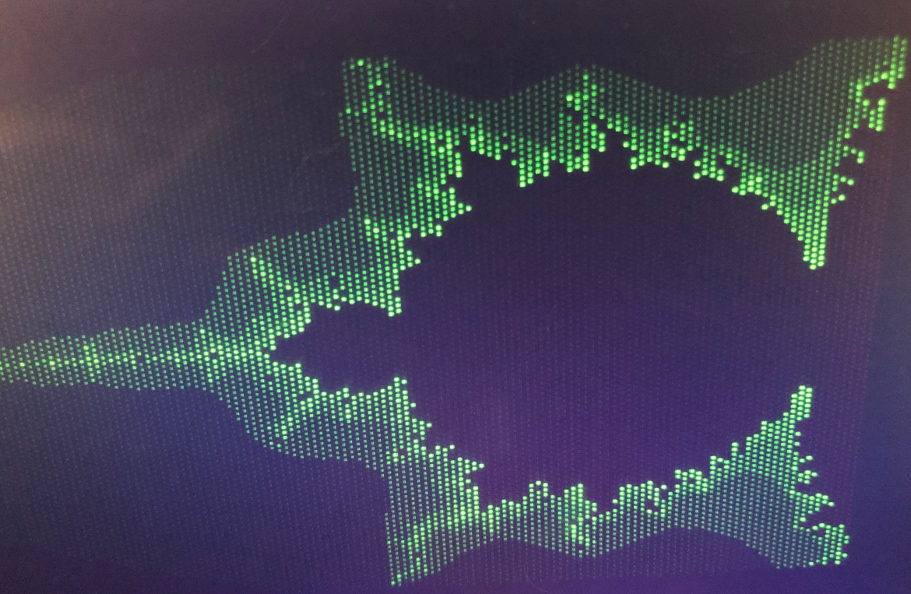

# ecrv32
A simple RISC-V implementation (model: rv32imc)

Current version, when synthesized/implemented, runs at 100Mhz on an Arty S7-25 FPGA board at 3 clocks per instructions on average.

# Prerequisites

Hardware / Software:
- Vivado 2020.2
- Digilent Arty S7-25 FGPA board (or pin/part compatible) board
- Digilent microSD PMOD connected to slot A (optional)
- Digilent VGA output PMOD connected to slots B&C (optional)
- The riscv-tool utility from https://github.com/ecilasun/riscvtool to be able to upload your own executables over USB UART
- Visual Studio Code to develop your own ELF executables (based on samples from https://github.com/ecilasun/riscvtool project)

# Features
- 64Kbytes of on-chip RAM (RAM addresses between 0x00000000-0x0000FFFF)
- SD Card access (with small SDCard library and a simple FAT filesystem access library, memory to access the card mapped outside RAM range)
- UART access (UART incoming byte count, received byte, send byte addresses mapped outside RAM range)
- VGA video output at 256x192x8bpp resolution (60Hz, framebuffer address mapped outside RAM range)
- RISC-V with base integer, mul/div/rem and compressed instruction support
- 32x16bits instruction cache
- No data cache
- Memory mapped peripheral access (UART/SDCard)
- 3 clocks per instruction on average
- Not pipelined

# Planned features
- Port to ULXS3 (85F)
- Utilize SDRAM on the ULX3S (burst read/write)
- Increase video resolution
- Add a custom GPU to support basic primitives and/or sprites
- Add atomic instructions and floating point to update the instruction set to rv32imacf)
- Add a PIC
- Add a second core
- Add data cache using the burst read/writes on SDRAM
- Increase instruction cache size
- Support booting an OS

NOTE: Documentation is in progress, more detail will follow briefly.

# Example code

Please see the https://github.com/ecilasun/riscvtool repository for examples. Here's a sample of ECRV32 running the mandelbrot.elf from that repository, outputting to a small LCD panel attached to the VGA PMOD ports

